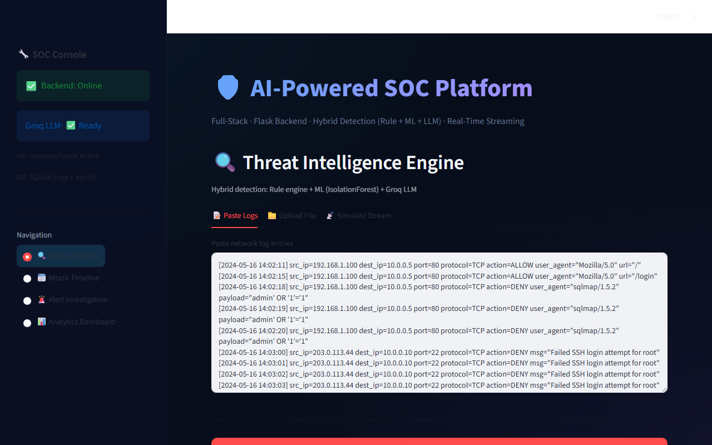
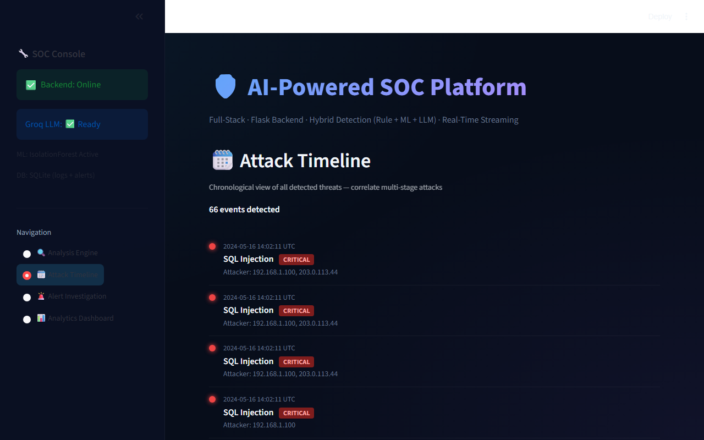
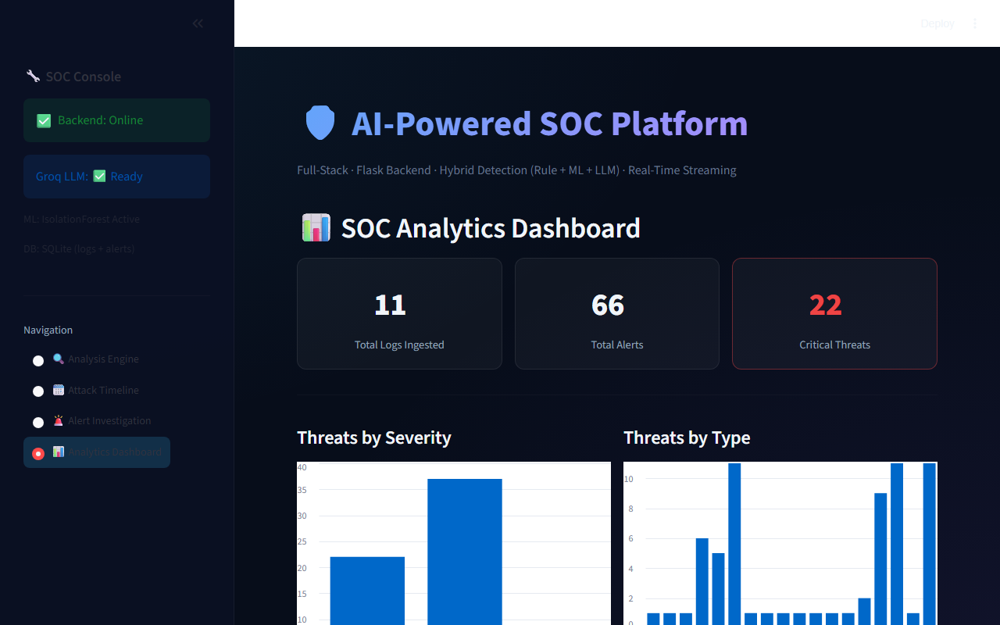

<h1 align="center">
  🛡️ AI-Powered Network Security Analyzer
</h1>
<p align="center">
  <b>SOC Platform with Hybrid Threat Detection: Rule Engine + ML (IsolationForest) + LLM (Groq)</b>
</p>

<p align="center">
  
  
  
  
  
  
</p>

---

## 📖 Overview

A full-stack AI-powered Security Operations Center (SOC) platform that analyzes network logs using a **3-layer hybrid detection engine**:

| Layer | Technology | Purpose |
|-------|-----------|---------|
| **Layer 1** | Regex Rule Engine | Instant pattern matching against known threat signatures |
| **Layer 2** | IsolationForest ML | Statistical anomaly detection on traffic behavior |
| **Layer 3** | Groq LLM (Llama 3.3 70B) | Semantic analysis and human-readable threat context |

The platform provides **MITRE ATT&CK mapping**, **kill-chain correlation**, **automated firewall script generation**, and a beautiful dark-themed SOC dashboard.

---

## 📸 Screenshots

### Analysis Engine & Threat Timeline



### SOC Analytics


---

## ✨ Key Features

- 🔍 **Hybrid Threat Detection** — 3-layer pipeline (Rule + ML + LLM) for comprehensive coverage
- 🎯 **MITRE ATT&CK Mapping** — Each threat linked to ATT&CK technique IDs (T1190, T1110, etc.)
- 🔗 **Attack Chain Correlation** — XDR-style multi-stage attack chain identification
- 📡 **Real-Time Streaming** — Line-by-line log ingestion simulating live syslog feeds
- 🛡️ **Incident Response Playbooks** — Auto-generated iptables/UFW firewall scripts (human-in-the-loop)
- 📊 **SOC Analytics Dashboard** — Severity distribution, threat type breakdown, timeline visualization
- 🗄️ **Persistent Storage** — SQLite database for alerts and raw logs
- 🎨 **Premium Dark UI** — Glassmorphism-styled Streamlit dashboard with Space Grotesk typography

---

## 🏗️ Architecture

```
┌─────────────────────────────────────────────────────┐
│                 Streamlit Frontend                    │
│           (dashboard.py — Pure API Client)            │
└────────────────────┬────────────────────────────────┘
                     │ REST API (http://127.0.0.1:5001)
┌────────────────────▼────────────────────────────────┐
│                 Flask Backend (app.py)                │
│  ┌──────────┐  ┌──────────┐  ┌────────────────────┐ │
│  │  Rule     │  │  ML      │  │  Groq LLM          │ │
│  │  Engine   │→ │  Anomaly │→ │  Semantic Analysis  │ │
│  │(regex)    │  │(IsoForest│  │  (Llama 3.3 70B)   │ │
│  └──────────┘  └──────────┘  └────────────────────┘ │
│        ↓              ↓              ↓               │
│  ┌─────────────────────────────────────────────────┐ │
│  │     Unified Threat Report + MITRE Mapping        │ │
│  └─────────────────────────────────────────────────┘ │
│        ↓                                             │
│  ┌──────────┐  ┌──────────────────────────────────┐  │
│  │ SQLite   │  │  Response Engine                  │  │
│  │ Database │  │  (Firewall Scripts + Playbooks)   │  │
│  └──────────┘  └──────────────────────────────────┘  │
└─────────────────────────────────────────────────────┘
```

---

## 🚀 Quick Start

### Prerequisites
- Python 3.8+
- Free Groq API key → [console.groq.com/keys](https://console.groq.com/keys)

### 1. Clone & Install

```bash
git clone https://github.com/<your-username>/network-security-analyzer.git
cd network-security-analyzer

# Create virtual environment
python -m venv venv
source venv/bin/activate   # Windows: venv\Scripts\activate

# Install dependencies
pip install -r requirements.txt
```

### 2. Configure API Key

Create `backend/.env`:
```
GROQ_API_KEY=your_groq_api_key_here
```

### 3. Start the Backend (Flask API)

```bash
cd backend
python app.py
# → Backend running on http://127.0.0.1:5001
```

### 4. Start the Frontend (Streamlit Dashboard)

```bash
# In a new terminal, from project root:
cd frontend
streamlit run dashboard.py
# → Dashboard at http://localhost:8501
```

---

## 📂 Project Structure

```
network-security-analyzer/
├── backend/
│   ├── app.py                 # Flask REST API (thin controller)
│   ├── detection.py           # 3-layer hybrid detection engine
│   ├── response.py            # Firewall script generator + recommendations
│   ├── db.py                  # SQLite operations (raw_logs + alerts)
│   ├── ingestion.py           # Real-time log streaming simulator
│   ├── .env                   # Groq API key (NOT committed)
│   └── models/
│       └── anomaly_detector.py # IsolationForest ML model
├── frontend/
│   ├── dashboard.py           # Streamlit SOC dashboard
│   └── .streamlit/
│       └── config.toml        # Streamlit theme config
├── sample_attack_logs.txt     # Sample logs for testing
├── requirements.txt           # Python dependencies
├── .gitignore
└── README.md
```

---

## 🎯 Threat Detection Coverage

| Threat Type | Severity | MITRE ATT&CK | Kill Chain Phase |
|------------|----------|---------------|-----------------|
| SQL Injection | CRITICAL | T1190 | Exploitation |
| SSH Brute Force | HIGH | T1110 | Credential Access |
| C2 Communication | CRITICAL | T1071 | Command & Control |
| Data Exfiltration | HIGH | T1041 | Exfiltration |
| Port Scanning | MEDIUM | T1046 | Reconnaissance |
| Privilege Escalation | HIGH | T1078 | Privilege Escalation |

---

## 🔌 API Endpoints

| Method | Endpoint | Description |
|--------|----------|-------------|
| `POST` | `/api/analyze` | Full 3-layer batch analysis |
| `POST` | `/api/ingest` | Line-by-line streaming ingestion |
| `GET` | `/api/alerts` | Retrieve stored alerts (with severity filter) |
| `GET` | `/api/timeline` | Chronological attack timeline |
| `GET` | `/api/stats` | Aggregated analytics data |
| `GET` | `/api/logs` | Raw ingested log lines |
| `GET` | `/api/health` | System health check |
| `POST` | `/api/download-script` | Download firewall response script |

---

## 🧪 Sample Attack Logs

Use the included `sample_attack_logs.txt` to test the system:
```
[2024-05-16 14:02:11] src_ip=203.0.113.42 dst_ip=10.0.0.5 port=3306 payload="SELECT * FROM users WHERE id=1 OR 1=1"
[2024-05-16 14:02:45] src_ip=203.0.113.42 Failed SSH login attempt for admin from 203.0.113.42
[2024-05-16 14:05:33] src_ip=10.0.0.99 dst_ip=198.51.100.77 req="callhome.evildom.xyz" protocol=DNS
...
```

---

## 🛠️ Tech Stack

| Component | Technology |
|-----------|-----------|
| Backend API | Flask + Flask-CORS |
| Frontend UI | Streamlit |
| ML Model | scikit-learn IsolationForest |
| LLM | Groq API (Llama 3.3 70B Versatile) |
| Database | SQLite3 |
| Styling | Custom CSS (Dark Theme, Glassmorphism) |

---

## ⚠️ Security Note

- Sensitive files containing API keys (like `.env`) are **not committed** to version control for security purposes. If you are deploying this yourself, you must provide your own API keys.
- Firewall scripts are generated as **recommendations only** — they require manual review and execution (Human-in-the-Loop policy).

---

## 📜 License

This project is developed as an academic project for network security analysis and education purposes.

---

<p align="center">
  Made with ❤️ using Python, Flask, Streamlit, scikit-learn, and Groq AI
</p>
